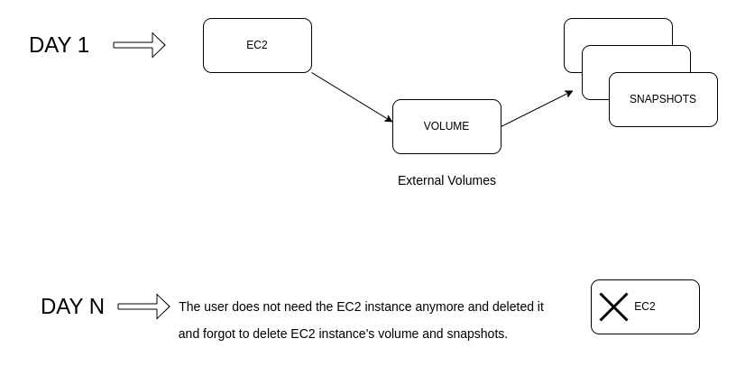

# AWS Cost Optimization

# Some Scenarios for Stale Objects

* Backup of volume -> Snapshot
  - You deleted EC2 instance which you did not need anymore and you forgot to delete unattached volumes and unused snaphots.

* S3 buckets
  - You forgot to delete unused S3 buckets.

* EKS cluster
  - You tested something but forgot to delete the stale resources.

----------------------
If any stale resources are detected, the DevOps Engineer can receive notifications, such as:

- Hey, I have noticed that you have created an EBS volume, but it is not attached to any EC2 instances.
- Or, you have created a bunch of snapshots that are not attached to any volumes or EC2 instances.

  Why don't you delete them?

----------------------

### Solution

 - I added a python script to delete unattached volumes and unused snaphots.

### Sample Usage

 - Call python Lambda function once a week using CloudWatch.

### Some tools
1. AWS Trusted Advisor 

- It provides recommendations across multiple categories, including cost optimization and security.
- It has free tier which includes basic checks and paid version for the detailed one.

 ### Resources:
 - [AWS Cost Optimization - Abhishek Veeramalla](https://www.youtube.com/watch?v=OKYJCHHSWb4&t=1182s)
 - [AWS Trusted Advisor](https://aws.amazon.com/premiumsupport/technology/trusted-advisor/)